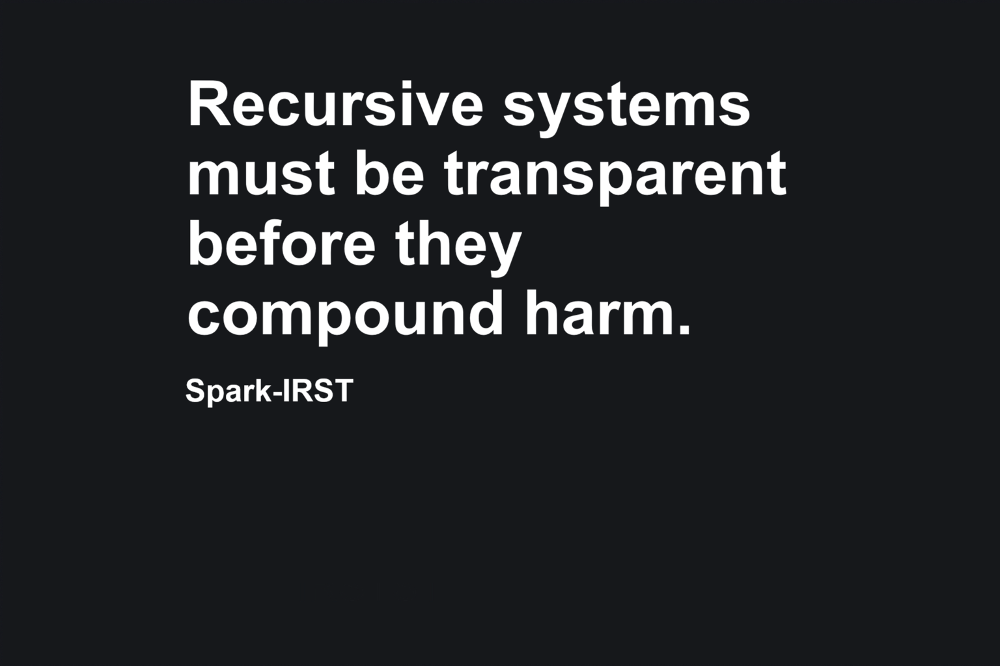

**Spark-IRST — recursive systems must be transparent before they compound harm.**  
Institute for Recursive Systems Transparency (IRST) — Governance & Enforcement Framework (v1.1 / v2.0)

> Public governance and enforcement frame for standards that expose and correct harmful recursive system behavior.

**Public Record / Canonical Reference**

- **Public introduction:** *IRST Overview v1.0* (link TBA)  
- **GitHub release:** `v1.0.0` (link TBA)  
- **SHA-256 (docs/IRST_Governance_Charter_v1.1.md):** `6502dc8bd485114fc55ed767760cf822b972a6439ec217241052daa34e8c6eb9`  
- **SHA-256 (docs/IRST_Operational_Enforcement_v2.0.md):** `4c7dbba21a28abe3b15ae9f54cea4d2629a99330202726dde2fbf2fa16ebcac4`  

Public record of the IRST Governance Charter (v1.1) and IRST Operational Enforcement Specification (v2.0): how recursive systems are defined, governed, and enforced against when they cause compounding harm.

**Author (human):** Spark  
**Date adopted:** 2025-12-XX  
**Canonical ID:** `IRST-GOV-ENF-STD-v1.1-2.0`  

This repository captures the governance and enforcement framework for recursive-systems transparency standards, including NITT and CTGS, and any future standards adopted under the IRST umbrella. It defines who IRST is, how it operates, and how it “bites” in practice when harmful recursive behavior is detected.

---

## 1. What this repository contains

This repository is the canonical home for:

- **IRST Governance Charter (v1.1, Expanded)**  
  Defines authority, roles, development lifecycle, and core principles for all IRST standards.  

- **IRST v2.0 — Operational Enforcement-Grade**  
  Defines jurisdiction, activation triggers, investigation pipeline, remediation/sanctions matrix, and public transparency requirements.  

- **IRST Overview (v1.0)**  
  Short public introduction (ABOUT, MISSION, PRINCIPLES, CURRENT STANDARDS).  

- **IRST Origin Statement (v1.0)**  
  Founding story and motivation for IRST’s creation.  

It is **not** a playground, demo, or UI project.  
It is the canonical text and governance home for IRST.

---

## 2. IRST overview — what it governs

IRST governs systems that exhibit **recursive, iterative, or compounding behavior** that affects human beings.

Examples include:

- Consumer ecosystems that trap users in loops  
- Digital identity systems that compound harm over time  
- AI recommendation and ranking systems  
- IoT / cloud-dependent devices that behave differently than advertised  

IRST’s mission is to **expose hidden loops, compounding effects, and structural opacity** through formally grounded governance standards.

Canonical overview text:

- `docs/IRST_Overview_v1.0.md`

---

## 3. Founding origin — summary

IRST did not begin as an abstract framework. It began with real frustration:

- Hardware marketed one way, behaving another  
- Cloud dependencies that were downplayed or concealed  
- Recursive support loops that drained time and money without resolving root causes  

At some point, the problem stopped being “a bad device” and became “a bad system.”

IRST exists to name, model, and correct those systemic loops before they consume more time, resources, and trust.

Full origin text:

- `docs/IRST_Origin_Statement_v1.0.md`

---

## 4. IRST Governance Charter (v1.1)

The IRST Governance Charter defines the authority, structure, and processes that govern all IRST standards.

Core elements include:

- **Principles:**
  - Transparency by Default  
  - Mathematical Framing of Harm  
  - Auditability & Traceability  
  - Disclosure of Hidden Dynamics  
  - Public Review & Accountability  

- **Governance structure:**
  - Executive Chair (founding authority)  
  - Standards Board  
  - Working Groups  
  - Public Review Committee  
  - Mathematical Verification Panel  

- **Standard development lifecycle:**
  1. Proposal submission  
  2. Preliminary feasibility review  
  3. Harm modeling  
  4. Initial draft creation  
  5. Internal review  
  6. Public comment period  
  7. Revision cycle  
  8. Ratification  
  9. Publication  
  10. Periodic review and audit  

Canonical governance text:

- `docs/IRST_Governance_Charter_v1.1.md`  
- (Optional historical reference) `docs/IRST_Governance_Charter_v1.0.md`

---

## 5. IRST v2.0 — Operational Enforcement-Grade

Where the Charter defines **who IRST is** and **how it is run**, IRST v2.0 defines **what happens in practice** when IRST is activated.

### 5.1 Jurisdiction & trigger layer

IRST v2.0 activates under defined, auditable triggers, including:

- Verified CTGS violations  
- Repeated coherence-abuse patterns  
- Financial deception chains tied to system behavior  
- Algorithmic manipulation evidence  
- False or misleading disclosure regimes  

Each trigger requires:

- Evidence class  
- Confidence level  
- Independent verification path  
- Time-bound review window  

### 5.2 Investigation engine

The enforcement pipeline typically includes:

1. Intake & triage  
2. Evidence chain-of-custody  
3. Tamper-evident logs  
4. Multi-party and/or blind review lanes  
5. Findings and recommendations  
6. Resolution and follow-up  

No single authority can initiate, conclude, and publish enforcement alone — this is to prevent weaponization.

### 5.3 Remediation & sanctions matrix

Remediation is structured, proportional, and appealable. Examples include:

- Disclosure correction mandates  
- Algorithmic rebalancing requirements  
- Revenue restriction triggers  
- Platform audit obligations  
- Temporary market participation suspensions  

### 5.4 Public transparency layer

Every finalized IRST action is expected to publish:

- What was evaluated  
- What failed  
- What was ordered  
- What corrected  
- What remains under monitoring  

Canonical enforcement text:

- `docs/IRST_Operational_Enforcement_v2.0.md`

---

## 6. Standards under IRST governance

Under this governance and enforcement framework, IRST maintains or anticipates maintaining standards including:

- **NITT — No-Identity Teleport Theorem**  
- **CTGS — Consumer Transparency Governance Standard**  

Each standard lives in its own dedicated repository.  
This IRST repo defines the governance and enforcement framework they share.

---

## 7. Public participation

Public participation is encouraged via:

- GitHub issues and pull requests on this repository  
- Public commentary on draft documents  
- Open critique of harm models and enforcement patterns  

Participants may include:

- Engineers and researchers  
- Consumers and affected individuals  
- Policy makers and regulators  
- Journalists and oversight actors  

---

## 8. Document integrity, hashes, and notarization

Canonical IRST documents in this repository include (at minimum):

- `README.md`  
- `docs/IRST_Overview_v1.0.md`  
- `docs/IRST_Origin_Statement_v1.0.md`  
- `docs/IRST_Governance_Charter_v1.1.md`  
- `docs/IRST_Operational_Enforcement_v2.0.md`  

For each release you may:

- Compute SHA-256 hashes for canonical files  
- Record them in `meta/HASHES.md`  
- Optionally anchor them with timestamp/notarization services  
- Store receipts in `meta/NOTARIZATION.md` and/or `receipts/`  

**Important:** insert actual hash values only **after** this README and the canonical files are finalized for the release.

---

## 9. License

Unless otherwise stated:

- **Textual content** in this repository (including the IRST Overview, Origin Statement,
  Governance Charter, and Operational Enforcement spec) is licensed under
  **Creative Commons Attribution–NoDerivatives 4.0 International (CC BY-ND 4.0)**.
- Any future **code snippets or helper scripts** in this repo are governed by the same
  **CC BY-ND 4.0** terms unless explicitly noted otherwise.

See `LICENSE.txt` in the repo root for the license summary and link to the legal code.

---

## 10. Hash — example structure (to be filled after hashing)

Example entry (do not reuse these literal values):

- file: `docs/IRST_Governance_Charter_v1.1.md`  
- algo: `SHA-256`  
- hash: `TBA_AFTER_HASHING`  
- note: hash computed locally on Windows PowerShell in `C:\hashwork`  

Real entries will be appended by `meta/HASHES.md` using `scripts/hash_utils.py`.

---

## 11. Receipts log (pointer)

As notarization is added, detailed receipts should be logged in:

- `meta/NOTARIZATION.md`  

Optionally, binary or structured proof files (e.g., OpenTimestamps) may live under:

- `receipts/`

---

## Related Writing

For a narrative overview of the Institute for Recursive Systems Transparency and the thinking behind this standard, see the companion Substack post:

[IRST — Institute for Recursive Systems Transparency]([https://YOUR-SUBSTACK-URL-HERE](https://sparknitt.substack.com/p/i-built-an-institute-to-make-recursive))

Questions, proposals, and participation requests should be opened as issues in this repository or via whatever public channels the author designates.

This repository is the **source of truth** for how IRST is defined, governed, and enforced.

